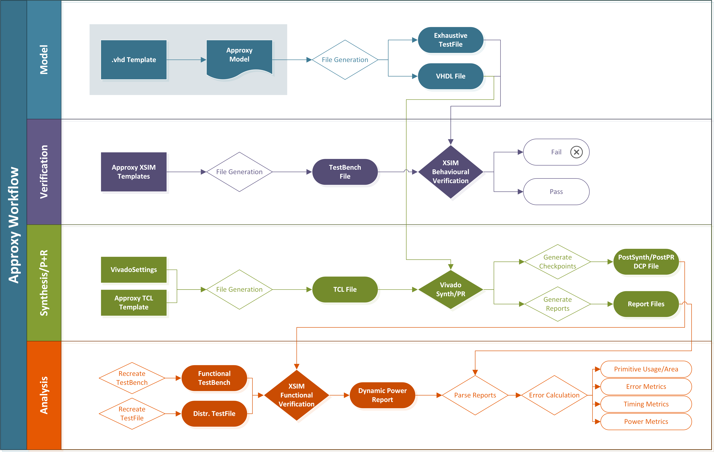

# Approxy
Golang tool generating VHDL multipliers using approximate computing. 

## Requirements
- Go 1.17
- "vivado", "xvhdl", "xelab" and "xsim" within $PATH
- Tested for:
    - Vivado v2021.1
    - Linux (not tested for Windows, it probably work)
    - Requires "vivado", "xvhdl", "xelab" and "xsim" within $PATH

## How to use
- Clone repository to local computer
- Edit main.go
- Build by running in main folder:
- >go install approxy
- Run by using:
- >approxy

### By default Approxy will make two folders:
- OutputPath or /output, is used as a temp folder to output VHDL and TCL files, and is used to output Vivado logs
- ReportPath or /report, is used to output JSON reports with final result data

## :warning: Warning: 
By default Approxy clears the OutputPath folder before executing the main() function. Make sure to back up useful files (VHDL, TCL logs, Vivado reports, etc.) from the previous execution, before running 'Approxy' again. Clearing functionality can naturally be removed in the init() function, but might interfere with Vivado synthesis.